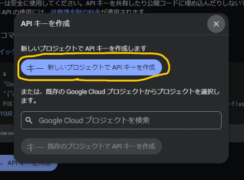

# Video to Article (Next)
動画をAIで記事に変換して読むことができるブラウザ拡張機能です。

<video src="readme-assets/demo.mp4" controls="true"></video>

> [クリエイティブ・コモンズ](https://support.google.com/youtube/answer/2797468)に基づき[Yusuke](https://www.youtube.com/@yu_sukemon)様の[【ゆっくり実況】霊夢と魔理沙と妖夢のマインクラフト #1](https://www.youtube.com/watch?v=4uA_gGiTSP0)を使用しています。

> [!NOTE]
> 本拡張機能を使用するには[Googleのサイト](https://ai.google.dev/)で Gemini の API キーを取得しておく必要があります。
> また、Gemini APIを従量課金プランにしている場合、APIの使用料が発生します。

## インストール方法
> [!NOTE]
> 現在Chromeウェブストアでの配布は審査中です。
> ここでは、手動で拡張機能をダウンロードしてChromeに追加する方法を解説します。

### Releases からダウンロード
[このリポジトリのReleasesページ](https://github.com/k0range/video2article-next/releases/latest)から`video2article-next-～～-chrome.zip`をダウンロードします。

### ZIP ファイルを展開
ダウンロードしたZIPファイルを展開します。

### Chrome に追加
1. [chrome://extensions](chrome://extensions)にアクセスし、画面右上の「デベロッパーモード」を有効にします。

2. 「パッケージ化されていない拡張機能を読み込む」をクリックし、ZIPファイルを展開したフォルダを選択します。

インストールはこれで完了です。利用するには 詳細 > 拡張機能のオプション にGeminiのAPIキーを入力する必要があります。

## API キーの取得手順
1. [Google AI Studio](https://aistudio.google.com/)を開きます。（Googleアカウントが必要です）
2. 左サイドバーの「Get API key」をクリックします。
3. 「APIキーを作成」をクリックして、「新しいプロジェクトで API キーを作成」を選びます。

4. 生成されたAPIキーをコピーして、拡張機能のオプションに貼り付けます。
> [!WARNING]
> このAPIキーは教えたり、共有したりしないでください。

5. 作成したAPIキーの「プラン」が意図したものになっていることを確認します。
