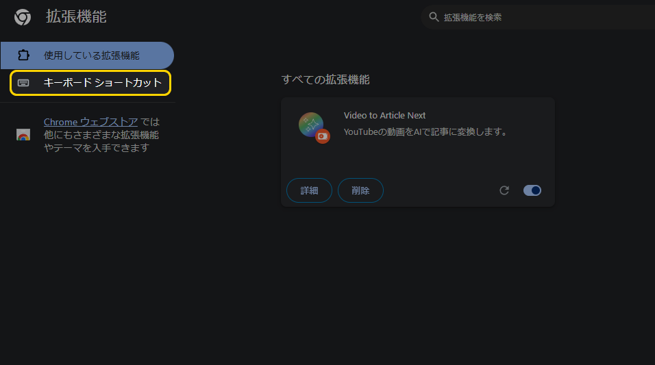
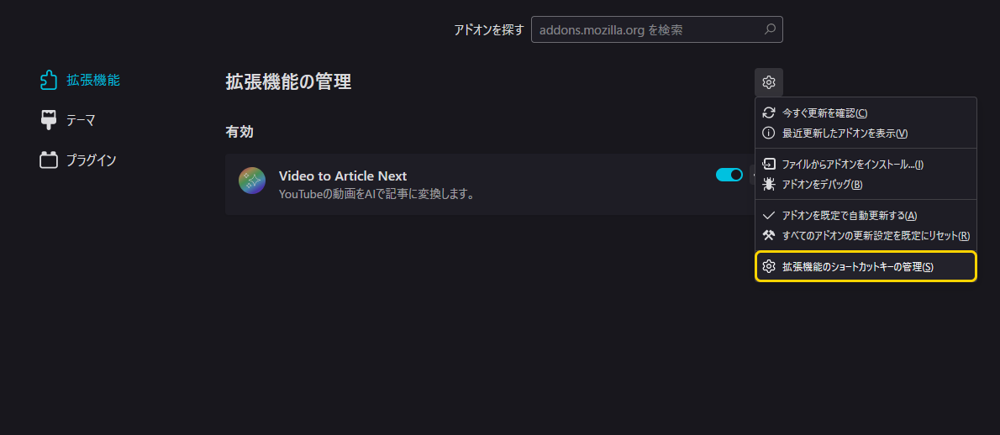
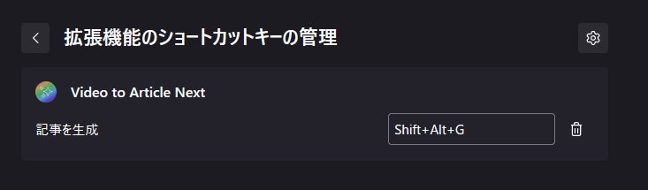

# ショートカットキーの設定
Video to Article Next のショートカットキーは、ブラウザ側の設定画面から設定することができます。

## Chrome・Chromium系の場合
1. [拡張機能のページ](chrome://extensions/)のメニューから、「キーボード ショートカット」を開きます。

2. 「Video to Article Next」の部分からショートカットキーの設定が可能です。

## Firefox 系の場合
1. [アドオンマネージャー](about:addons)の右上の設定ボタンから、「拡張機能のショートカットキーの管理」に進みます。

2. 「Video to Article Next」の部分からショートカットキーの設定が可能です。

